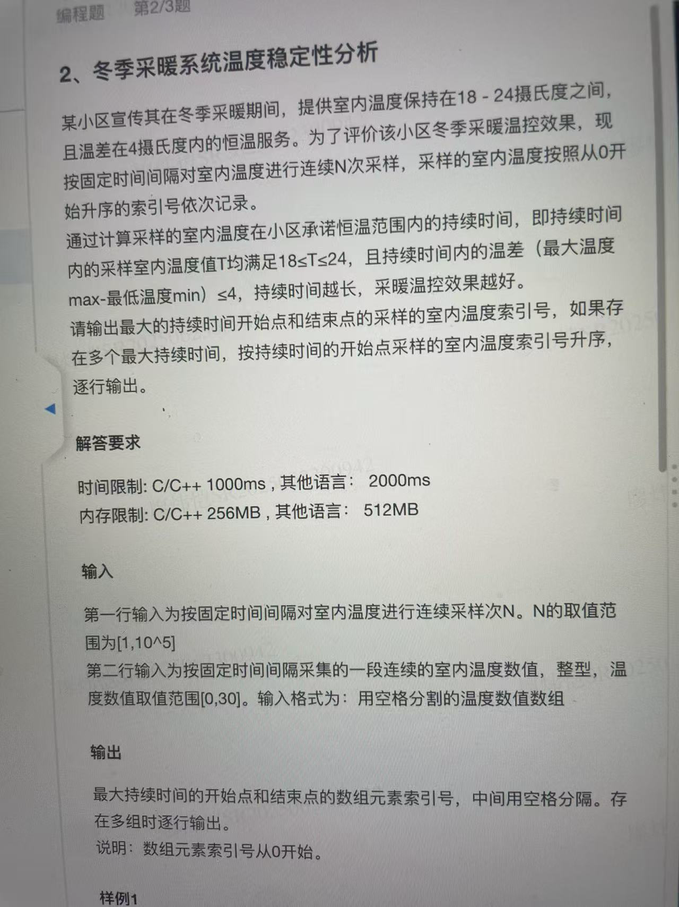

# Sliding Window / Two Pointers

> Section: **Algorithm** — extracted from leetcode_solution.md (lines 1314-1390)

### sliding window / two pointers

#### 1. What kind of problem can/cannot be solved by two pointers

1. https://leetcode.com/problems/subarray-sum-equals-k/solutions/301242/general-summary-of-what-kind-of-problem-can-cannot-solved-by-two-pointers/
   1. If a wider scope of the sliding window is valid, the narrower scope of that wider scope is valid
   2. If a narrower scope of the sliding window is invalid, the wider scope of that narrower scope is invalid
2. so in problem ([560. Subarray Sum Equals K](https://leetcode.com/problems/subarray-sum-equals-k/)), since the element in nums can be negative, wider scope and narrow scope has no direct relation, so it can't be solved by two pointers.
3. 

#### example problems

1. https://leetcode.com/problems/binary-subarrays-with-sum/description/

#### kmp算法（一种字符串匹配算法）

##### 介绍

1. https://zhuanlan.zhihu.com/p/83334559
2. **KMP 算法永不回退 `txt` 的指针 `i`，不走回头路（不会重复扫描 `txt`），而是借助 `dp` 数组中储存的信息把 `pat` 移到正确的位置继续匹配**，时间复杂度只需 O(N)，用空间换时间，所以我认为它是一种动态规划算法。
3. 影子状态：

   1. 因为我们想尽可能少的回退状态，所以

   2. 相当于再来一个指针来匹配，转移，这样，只有当原来的指针再一次遇到了pat的前缀，影子状态才会更新。

   3. ```java
      class kmp{
        private int[][] dp;
        private char[] pat;
        
        
        
        
      }
      ```

      


##### 相关题目

1. [28. 找出字符串中第一个匹配项的下标](https://leetcode.cn/problems/find-the-index-of-the-first-occurrence-in-a-string/)

   1. ```java
      class Solution {
          public int strStr(String ss, String pp) {
              int n = ss.length(), m = pp.length();
              char[] s = ss.toCharArray(), p = pp.toCharArray();
              // 枚举原串的「发起点」
              for (int i = 0; i <= n - m; i++) {
                  // 从原串的「发起点」和匹配串的「首位」开始，尝试匹配
                  int a = i, b = 0;
                  while (b < m && s[a] == p[b]) {
                      a++;
                      b++;
                  }
                  // 如果能够完全匹配，返回原串的「发起点」下标
                  if (b == m) return i;
              }
              return -1;
          }
      }
      ```

   2. 把原串的每一个元素作为起点

   3. 该解法是一种暴力揭发，时间复杂度O(MN),

   

#### 滑动窗口+单调队列



1.

---

## Appendix: Tips consolidated from `coding-tricks.md`

### Tip #14 — Sliding window templates (fixed / variable)

### 14. Sliding window/two pointers

1. 题单

   1. https://leetcode.cn/circle/discuss/0viNMK/

2. 定长滑窗

   1. https://leetcode.cn/problems/maximum-number-of-vowels-in-a-substring-of-given-length/solutions/2809359/tao-lu-jiao-ni-jie-jue-ding-chang-hua-ch-fzfo/

3. 不定长滑窗

   1. 先确定左边界，再枚举右边界

      1. for(right++)
         1. 加入右边界的值
         2. while() 减去左边届的值，更新左边届直至满足条件
         3. 更新统计值

   2. example

      1. ```java
         class Solution {
             public int maxTotalFruits(int[][] fruits, int startPos, int k) {
                 int left = lowerBound(fruits, startPos - k); // 向左最远能到 fruits[left][0]
                 int ans = 0, s = 0, n = fruits.length;
                 for (int right = left; right < n && fruits[right][0] <= startPos + k; right++) {
                     s += fruits[right][1]; // 枚举最右位置为 fruits[right][0]
                     while (fruits[right][0] * 2 - fruits[left][0] - startPos > k &&
                             fruits[right][0] - fruits[left][0] * 2 + startPos > k)
                         s -= fruits[left++][1]; // fruits[left][0] 无法到达
                     ans = Math.max(ans, s); // 更新答案最大值
                 }
                 return ans;
             }
         
             // 见 https://www.bilibili.com/video/BV1AP41137w7/
             private int lowerBound(int[][] fruits, int target) {
                 int left = -1, right = fruits.length; // 开区间 (left, right)
                 while (left + 1 < right) { // 开区间不为空
                     // 循环不变量：
                     // fruits[left][0] < target
                     // fruits[right][0] >= target
                     int mid = (left + right) >>> 1;
                     if (fruits[mid][0] < target)
                         left = mid; // 范围缩小到 (mid, right)
                     else
                         right = mid; // 范围缩小到 (left, mid)
                 }
                 return right;
             }
         }
         ```

---

## Problems consolidated from `miscellaneous-problems.md`

### [26. 删除有序数组中的重复项](https://leetcode.cn/problems/remove-duplicates-from-sorted-array/)

1. 这段程序可以怎么优化？

   ```c++
     int removeDuplicates(vector<int>& nums) {
           int j= INT_MAX ;
           for(int i=0;i<nums.size();i++){
               if(nums[i]==j){
                   nums.erase(nums.begin()+i);
                   i--;
               }
               j = nums[i];
           }
           return nums.size();
       } 
   ```

   1. 这段程序可以通过使用**双指针**来优化，从而将时间复杂度降至 O(n)。以下是优化后的代码：

      ```c++
      int removeDuplicates(vector<int>& nums) {
          if (nums.empty()) {
              return 0;
          }
          
          int i = 0;
          for (int j = 1; j < nums.size(); j++) {
              if (nums[j] != nums[i]) {
                  i++;
                  nums[i] = nums[j];
              }
          }
          
          return i + 1;
      }
      
      ```

      1. 在上面的代码中，我们使用了两个指针 i 和 j，其中 i 指向当前没有重复元素的位置，而 j 则用于遍历整个数组。当发现 nums[j] 与 nums[i] 不同时，将 nums[j] 赋值给 nums[i+1]，并将 i 向前移动一位。这样，我们可以保证 nums[0, i] 中的元素都是不重复的。最后返回值为 i+1，即不重复元素的数量。


         这种方法的时间复杂度为 O(n)，因为我们只需要遍历一次数组就可以完成任务，而不需要像原始代码中那样每次删除重复元素。
    
      2. 分析下上面我写的代码的时间复杂度？
    
         1. `erase` 函数的时间复杂度是 O(n)，因为它需要将要删除位置之后的所有元素向前移动，以填补删除后的空缺。这意味着，如果要删除的元素位于数组的开头，那么所有元素都需要向前移动一位；如果要删除的元素位于数组的中间，那么要删除元素之后的所有元素都需要向前移动一位。这个过程需要遍历所有要移动的元素，因此时间复杂度为 O(n)。
    
            需要注意的是，如果您只需要删除 vector 中的最后一个元素，可以使用 `pop_back` 函数来完成，其时间复杂度为常数级别 O(1)。
    
         2. 上面的代码中使用了一个 for 循环来遍历整个数组，时间复杂度为 O(n)。在循环中，我们还使用了一个 if 语句来判断当前元素是否与前一个元素相同，这需要常数时间。在 if 语句的条件为真时，我们还需要调用 `erase` 函数来删除当前元素，这需要 O(n) 的时间复杂度。因此，如果数组中有大量重复元素，那么 `erase` 函数的调用次数也会很多，导致时间复杂度变高。
    
            综上所述，上面的代码的时间复杂度为 O(n^2)。如果数组中有大量重复元素，则该算法的性能会变得很差。

### [42. 接雨水](https://leetcode.cn/problems/trapping-rain-water/)

1. 暴力解法（超时）

   1. ```java
      class Solution {
          public int trap(int[] height) {
              int ans = 0;
              int flag = 0;
              int n =height.length;
              while(flag != 1){
                //一层层算
                  int leftB=0;
                  int rightB=0;
                  for(int i=0;i<n;i++){
                      if(height[i]!=0){
                          leftB = i;
                          break;
                      } 
                  }
                  for(int j=n-1;j>=0;j--){
                      if(height[j]!=0){
                          rightB = j;
                          break;
                      }
                  }
                  if(leftB == rightB){
                      flag = 1;
                      break;
                  }
                  // count
                  for(int k=leftB;k<rightB;k++){
                      if(height[k]==0){
                          ans++;
                      }
                  }
                  for(int j=0;j<n;j++){
                      if(height[j]>=1){
                          height[j]--;
                      }
                  }
              }
              return ans;
      
          }
      }
      ```

