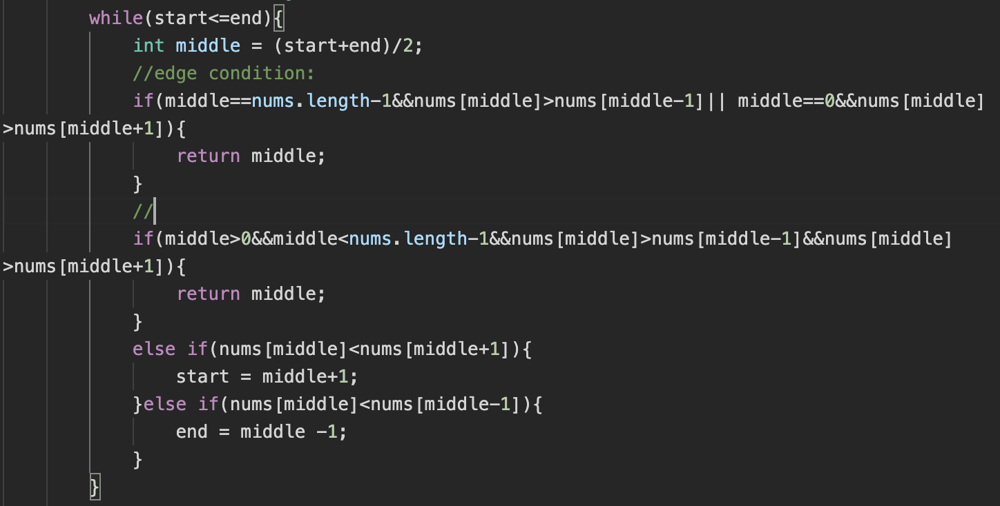
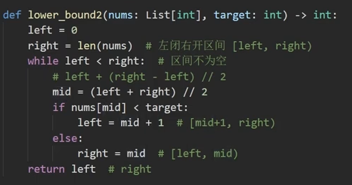
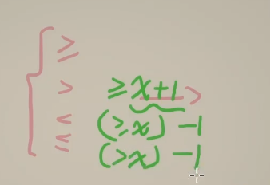
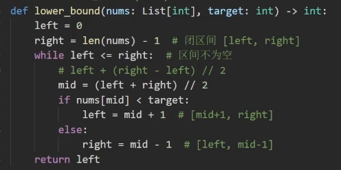

# Sorting (排序)

> Section: **Algorithm** — extracted from leetcode_solution.md (lines 1581-2111)

### 排序

1. java 有没有办法对一个二维数组，根据它的每个数组的第一个元素的大小，对这个二维数组排序？

   1. 在 Java 中，你可以使用 `Arrays.sort()` 方法来对二维数组进行排序，但是需要自定义比较器（Comparator）来指定排序规则。对于二维数组，你可以创建一个自定义的比较器，根据每个数组的第一个元素的大小来进行排序。

      以下是一个示例代码，演示如何对一个二维数组根据每个数组的第一个元素的大小进行排序：

      ```java
      import java.util.Arrays;
      import java.util.Comparator;
      
      public class Main {
          public static void main(String[] args) {
              int[][] array = {{3, 2}, {1, 4}, {2, 1}};
      
              // 使用自定义比较器按每个数组的第一个元素进行排序
              Arrays.sort(array, Comparator.comparingInt(a -> a[0]));
      
              // 打印排序后的二维数组
              for (int[] row : array) {
                  System.out.println(Arrays.toString(row));
              }
          }
      }
      ```

      在上面的示例中，我们首先定义了一个二维数组 `array`，然后使用 `Arrays.sort()` 方法和自定义的比较器 `Comparator.comparingInt(a -> a[0])` 对二维数组进行排序，该比较器按每个数组的第一个元素进行比较。最后，我们打印出排序后的二维数组。

2. 请你解释一下Arrays.sort(array, Comparator.comparingInt(a -> a[0]));这行代码的语法，并举其它例子说明自定义比较器是怎么用的

   1. 这行代码 `Arrays.sort(array, Comparator.comparingInt(a -> a[0]));` 的语法解释如下：

      - `Arrays.sort(array, ...)`：这部分调用了 `Arrays` 类中的 `sort` 方法，用于对数组进行排序。
      - `Comparator.comparingInt(a -> a[0])`：这部分是一个比较器，使用了 `Comparator` 类的 `comparingInt` 静态方法。在这里，`a -> a[0]` 是一个 Lambda 表达式，表示比较器会根据每个数组的第一个元素进行比较。

      另外，下面是一个例子说明如何使用自定义比较器来对对象列表进行排序：

      ```java
      import java.util.ArrayList;
      import java.util.Comparator;
      import java.util.List;
      
      class Person {
          String name;
          int age;
      
          public Person(String name, int age) {
              this.name = name;
              this.age = age;
          }
      
          @Override
          public String toString() {
              return "Person{name='" + name + "', age=" + age + "}";
          }
      }
      
      public class Main {
          public static void main(String[] args) {
              List<Person> personList = new ArrayList<>();
              personList.add(new Person("Alice", 25));
              personList.add(new Person("Bob", 30));
              personList.add(new Person("Charlie", 20));
      
              // 使用自定义比较器按年龄进行排序
              personList.sort(Comparator.comparingInt(Person::getAge));
      
              // 打印排序后的对象列表
              for (Person person : personList) {
                  System.out.println(person);
              }
          }
      }
      ```

      在上面的例子中，我们定义了一个 `Person` 类表示人员，然后创建了一个包含 `Person` 对象的列表 `personList`。我们使用 `Comparator.comparingInt(Person::getAge)` 来创建一个比较器，根据每个对象的年龄进行排序。最后，我们调用 `sort()` 方法对对象列表进行排序，并打印排序后的列表。

       1. Person::getName ::是什么意思?

          1. 在 Java 中，`Person::getName` 是一种方法引用（Method Reference）的写法。方法引用是用来简化 Lambda 表达式的一种方式，可以直接引用现有方法（静态方法、实例方法或构造方法），而不用重新编写一个Lambda表达式来调用该方法。

             在这种情况下，`Person::getName` 表示引用 `Person` 类中的 `getName` 方法。这种写法等价于使用 Lambda 表达式来调用 `getName` 方法，例如 `(person) -> person.getName()`。

             具体来说：

             - `Person::` 表示引用 `Person` 类中的方法。
             - `getName` 表示要引用的方法名称。

             因此，`Person::getName` 表示引用 `Person` 类中的 `getName` 方法，而不是直接调用该方法。这种写法在需要传递方法作为参数的情况下非常有用，可以使代码更加简洁和易读。

#### 1. 快速排序 QuickSort

1. 核心思想

   1. 冒泡排序+分治
      1. 每次都挑一个最左边的元素作为基准值，然后遍历数组，将比基准值小的元素都交换到基准值的左边
      2. 然后基准值就确定了它的位置，但是它左右两边的数组还是乱序的，于是对这两边递归地使用快速排序。
      3. 这有点像利用前序遍历+中序遍历 或者 后续遍历+中序遍历 构造二叉树，
         1. 

2. 代码示例

   1. ```Java
      public class QuickSort {
      
          // 快速排序主方法
          public static void quickSort(int[] arr, int left, int right) {
              if (left < right) {
                  // 分区操作：返回基准值的最终位置
                  int pivotIndex = partition(arr, left, right);
      
                  // 对左右子数组递归排序
                  quickSort(arr, left, pivotIndex - 1);
                  quickSort(arr, pivotIndex + 1, right);
              }
          }
      
          // 分区函数，返回 pivot 的最终位置
          private static int partition(int[] arr, int left, int right) {
              int pivot = arr[right];  // 选择最后一个元素作为基准
              int i = left - 1;        // 小于 pivot 的区域的尾部指针
      
              for (int j = left; j < right; j++) {
                  if (arr[j] <= pivot) {
                      i++;
                      swap(arr, i, j);
                  }
              }
      
              // 把 pivot 放到正确的位置
              swap(arr, i + 1, right);
              return i + 1;
          }
      
          // 交换数组元素
          private static void swap(int[] arr, int i, int j) {
              int temp = arr[i];
              arr[i] = arr[j];
              arr[j] = temp;
          }
      
          // 测试入口
          public static void main(String[] args) {
              int[] nums = {5, 2, 9, 1, 5, 6};
              quickSort(nums, 0, nums.length - 1);
      
              for (int num : nums) {
                  System.out.print(num + " ");
              }
              // 输出：1 2 5 5 6 9
          }
      }
      ```

3.  随机选一个pivot的值，这样的话可以避免1234567这样子的极端情况

   ```python
           
           def partition(nums:List[int], left:int, right:int) -> int:
               if left==right:
                   return left
               pivot_index = random.randint(left, right)
               nums[pivot_index], nums[right] = nums[right], nums[pivot_index]
               pivot = nums[right]
               index = left
               # 从左至右扫描。把所有小于
               for j in range(left,right):
                   if nums[j] < pivot
                       nums[j], nums[index] = nums[index], nums[j]
                       index+=1
               
               nums[right],nums[index] = nums[index], nums[right]
               return index
                   
   
           def quicksort(nums: List[int], left:int, right:int):
   
               if left>=right:
                   return
               partion = partition(nums,left,right)
               quicksort(nums,left,partion-1)
               quicksort(nums,partion+1,right)
   
           quicksort(nums,0,len(nums)-1)
           return nums
   ```

4. 进一步优化：处理 2，2，2，2，2，2，2，2这类的情况

   1. 三路排序

   2. ```python
      import random
      
      class Solution:
          def sortArray(self, nums):
      
              def quicksort(left, right):
                  if left >= right:
                      return
      
                  pivot = nums[random.randint(left, right)]
      
                  lt = left      # nums[left .. lt-1] < pivot
                  i = left       # nums[lt .. i-1] == pivot
                  gt = right     # nums[gt+1 .. right] > pivot
      
                  while i <= gt:
                      if nums[i] < pivot:
                          nums[lt], nums[i] = nums[i], nums[lt]
                          lt += 1
                          i += 1
                      elif nums[i] > pivot:
                          nums[i], nums[gt] = nums[gt], nums[i]
                          gt -= 1
                      else:
                          i += 1
      
                  quicksort(left, lt - 1)
                  quicksort(gt + 1, right)
      
              quicksort(0, len(nums) - 1)
              return nums
      
      ```

      

##### 多指针判断循环条件：定义好指针的语义，明确区间的两个端点

为什么循环判断条件为什么是<= 而不是 <? 

1. 这是**三路快排里最容易被问、但也最容易被“机械记忆”的一个点**。
   你这个问题问得非常好，说明你已经在**真正理解算法不变量（invariant）**了。

   我按 **「区间语义 → 不变量 → 反例」** 三步给你讲清楚。

   ------

   ## 一、先给每个指针一个**明确的语义**

   在这段代码里（我用你原变量名）：

   ```python
   lt = left
   i  = left
   bt = right
   pivot = ...
   ```

   我们**始终维护下面 4 个区间不变量**：

   ```
   [left      ... lt-1]  < pivot
   [lt        ... i-1 ]  == pivot
   [i         ... bt  ]  未处理
   [bt+1      ... right] > pivot
   ```

   👉 **关键点**：
   `i ... bt` 是「**尚未检查**」的区域

   ------

   ## 二、为什么循环条件必须是 `i <= bt`

   ### 1️⃣ 因为 `bt` 位置 **还没被处理**

   只要满足：

   ```text
   i <= bt
   ```

   就说明：

   > 至少还有 **一个未知元素** 需要分类

   ------

   ### 2️⃣ 当 `i == bt` 时会发生什么？

   此时区间变成：

   ```
   [i == bt]  ← 只剩一个元素没检查
   ```

   这个元素：

   - 可能 `< pivot`
   - 可能 `== pivot`
   - 可能 `> pivot`

   👉 **必须处理它一次**

   如果你用的是：

   ```python
   while i < bt:
   ```

   那么：

   - 当 `i == bt` 时
   - 循环直接退出
   - **这个元素永远没被分类**

   ❌ 不变量被破坏

   ------

   ## 三、用一个最小反例直接说明 `<` 会错

   ### 示例

   ```python
   nums = [2, 1]
   pivot = 2
   ```

   初始状态：

   ```
   lt = 0, i = 0, bt = 1
   ```

   ### 如果用 `while i < bt`

   #### 第 1 轮

   - i = 0 < 1 ✔
   - nums[0] == pivot → i += 1

   #### 第 2 轮

   - i = 1
   - i < bt ❌（1 < 1 为假）
   - 循环结束

   👉 **nums[1] = 1 从未被处理**

   最终数组仍是：

   ```python
   [2, 1]  # 错的
   ```

   ------

   ### 而 `while i <= bt`：

   #### 第 2 轮

   - i = 1 <= 1 ✔
   - nums[1] < pivot
   - swap 到左边
   - 排序正确完成

   ------

   ## 四、为什么在 `nums[i] > pivot` 时 **i 不动**

   这是同一层逻辑，顺带一起理解会很通。

   ```python
   elif nums[i] > pivot:
       nums[i], nums[bt] = nums[bt], nums[i]
       bt -= 1
   ```

   原因一句话：

   > 从 `bt` 换过来的元素是「未知的」，必须重新检查

   所以：

   - 不能 `i += 1`
   - 仍然停在 `i`
   - 这也是为什么需要 `i <= bt`

   ------

   ## 五、循环终止时，发生了什么？

   当循环结束：

   ```python
   i > bt
   ```

   说明：

   ```
   未处理区间 [i ... bt] 为空
   ```

   此时不变量自然收敛为：

   ```
   [left ... lt-1] < pivot
   [lt   ... bt ] == pivot
   [bt+1 ... right] > pivot
   ```

   👉 中间整段 `== pivot`
   👉 不再递归
   👉 性能直接起飞 🚀

   ------

   ## 六、一句话总结（非常像面试答案）

   > 因为 `i` 到 `bt` 表示尚未处理的区间，当 `i == bt` 时仍然有一个元素需要分类；只有使用 `i <= bt` 才能保证所有元素都被处理一次，维护三路快排的不变量。

   ------

   你现在问的已经是 **算法 invariant 层面的问题**，不是「模板怎么背」。
   如果你愿意，我可以下一步带你：

   - 用 **形式化不变量证明**这段循环的正确性
   - 或帮你把这段话压缩成 **15 秒白板解释版**（非常适合面试）

   你选一个。


#### 2. 归并排序

1. 主要思想就是

   1. 对一个数组切成一半

   2. 递归地对这两半进行归并排序

   3. 最后合并这两个已经拍过序的数组

      1. 怎么合并？

      2. 对于一个数组的两部分，用两个临时数组来存储，然后用两个指针分别比较临时数组的元素，哪个小就放到前面，最后复制剩余元素。

         ```java
         public class MergeSort {
             // 主方法，用于调用归并排序
             public static void main(String[] args) {
                 int[] arr = {12, 11, 13, 5, 6, 7};
                 System.out.println("给定的数组");
                 printArray(arr);    
         		MergeSort ob = new MergeSort();
             ob.sort(arr, 0, arr.length - 1);
         
             System.out.println("\n排序后的数组");
             printArray(arr);
         }
         
         // 归并排序的主要方法
         void sort(int arr[], int l, int r) {
             if (l < r) {
                 // 找到中间点
                 int m = (l + r) / 2;
         
                 // 分别对左右半边进行排序
                 sort(arr, l, m);
                 sort(arr, m + 1, r);
         
                 // 合并两个有序部分
                 merge(arr, l, m, r);
             }
         }
         
         // 合并方法，用于合并两个有序部分
         void merge(int arr[], int l, int m, int r) {
             // 计算两个部分的大小
             int n1 = m - l + 1;
             int n2 = r - m;
         
             // 创建临时数组
             int L[] = new int[n1];
             int R[] = new int[n2];
         
             // 复制数据到临时数组
             for (int i = 0; i < n1; ++i)
                 L[i] = arr[l + i];
             for (int j = 0; j < n2; ++j)
                 R[j] = arr[m + 1 + j];
         
             // 合并临时数组
         
             // 初始化索引
             int i = 0, j = 0;
         
             // 初始合并数组的索引
             int k = l;
             while (i < n1 && j < n2) {
                 if (L[i] <= R[j]) {
                     arr[k] = L[i];
                     i++;
                 } else {
                     arr[k] = R[j];
                     j++;
                 }
                 k++;
             }
         
             // 复制剩余的L[]元素
             while (i < n1) {
                 arr[k] = L[i];
                 i++;
                 k++;
             }
         
             // 复制剩余的R[]元素
             while (j < n2) {
                 arr[k] = R[j];
                 j++;
                 k++;
             }
         }
         
         // 用于打印数组的方法
         static void printArray(int arr[]) {
             int n = arr.length;
             for (int i = 0; i < n; ++i)
                 System.out.print(arr[i] + " ");
             System.out.println();
         }
         }
         
         ```

---

## Appendix: Tips consolidated from `coding-tricks.md`

### Tip #6 — Binary search (Java API + write-it-yourself)

### 6. Binary search

#### 6.1 JAVA binarysearch API

1. ```java
   lis = [2,5,7,18]
   num = 6
   Collections.binarySearch(lis,6) // return -pos-1(6 doesnt exist in lis)
   
   // so if we need to find a position where pos>= number,
   // we should normalize it first, 
     
     int pos = Collections.binarySearch(lis, num);
     if(pos<0){pos = -(pos+1);}
   // however, if lis has duplicate number, we should write binarySearch ourselves.
   
   
   ```

   

#### 6.2 write binary search ourself.

1. apart from search a specific value, (like 6 in 2 5 3 3 8 7 6 8 9 0), we can search a value meets some condition 
   1. just add the condition to the 
      1. in problem 162
         1. 
         2. the condition is larger than neighbor nodes or is the egde node
   2. Just to remember: 理解二分，请牢记区间的定义！区间内的数（下标）都是还未确定大小关系的，有的是 <，有的是 ≥；区间外的数（下标）都是确定大小关系的！对于本题（递增数组），区间左侧外面的都是 <，区间右侧外面的都是 ≥。从这个定义可以知道，找到了 ≥ 的数之后，要把这个数（下标）放在区间外面，而不是区间里面！
   3. for example:
      1. 
      2. in this type, ` if nums[mid] < target` means that all the elements with index <= mid are less than target, so you just change the leftbound of the interval to mid+1 (` left = mid + 1`)
   4. 
   5. 
   6. Why left?
      1. look the ternimation condition, when left = [every thing that lower than target]+1
      1. 统一写法：双闭区间，返回left指针（根据if else条件比target小的，都在left指针的左边）
      1. 注意返回的时候left的值可能比区间的最大的index还大1，这个说明target比该区间最大的值还大

