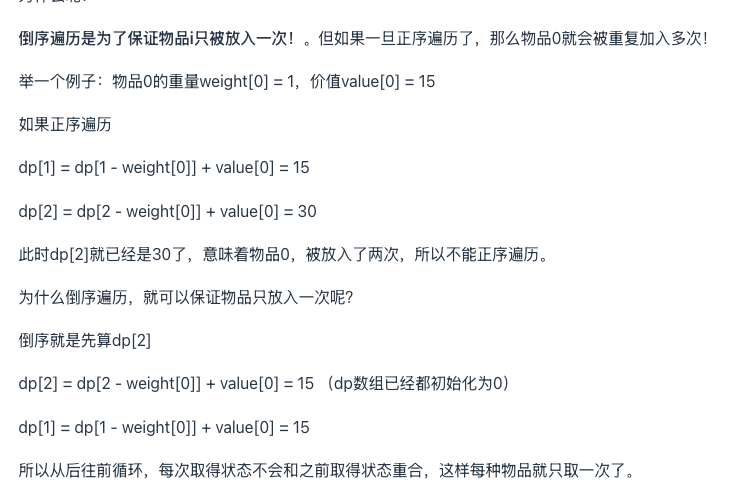

# Dynamic Programming

> Section: **Algorithm** — extracted from leetcode_solution.md (lines 2516-2556)

### Dynamic programming

1. [123. Best Time to Buy and Sell Stock III](https://leetcode.com/problems/best-time-to-buy-and-sell-stock-iii/)

   1. My solution(out of time limitation)

      1. ```java
         class Solution {
             public int maxProfit(int[] prices) {
                 //dp[i][j] means sell on i, j day to get the max profit, i<=j, if i==j means, only has 1 ransactions
         
                 int n = prices.length;
                 int[] dp = new int[n];
                 int maxProfit =0;
                 dp[0] = 0;
         
                 int minPrice= prices[0];
                 for(int k=1;k<n;k++){
                     minPrice = Math.min(minPrice, prices[k]);
                     dp[k] = prices[k] - minPrice;
                     maxProfit = Math.max(maxProfit, dp[k]);
                     
                 }
                 
                 for(int i=1;i<n;i++){
                     int min_2 = prices[i];
                     for(int j=i+1;j<n;j++){
                         min_2 = Math.min(min_2,prices[j]);
                         int i_j = dp[i] + prices[j]-min_2;
                         maxProfit = Math.max(maxProfit,i_j);
                     }
                 }
         
                 return maxProfit;
         
             }
         }
         ```

      2.

---

## Appendix: Tips consolidated from `coding-tricks.md`

### Tip #10 — DP — core idea & problem taxonomy (knapsack)

### 10. Dynamic programming

1. 解决动态规划问题的核心：找出子问题及其子问题与原问题的关系
   1. 动态规划要解决的都是一些问题的最优解，即从很多解决问题的方案中找到最优的一个。当我们在求一个问题最优解的时候，如果可以把这个问题分解成多个子问题，然后递归地找到每个子问题的最优解，最后通过一定的数学方法对各个子问题的最优解进行组合得出最终的结果。总结来说就是一个问题的最优解是由它的各个子问题的最优解决定的。
   2. 将子问题的解进行组合可以得到原问题的解是动态规划可行性的关键。
2. 问题分类
   1. https://leetcode.cn/circle/discuss/u9jlGz/
   2. 区间dp
      1. [5. Longest Palindromic Substring](https://leetcode.cn/problems/longest-palindromic-substring/)
         1. 更新dp数组的顺序
            1. 是往右上角递增的，所以应该斜着一层层更新
   3. 背包问题
      1. 01背包
         1. 每种物品至多用一次
         2. 先遍历物品，再从大到小遍历背包容量
            1. 之所以从大到小遍历是因为确保对于每个重量，每个物品至多用一次
            2. 
         3. 例题
            1. [416. Partition Equal Subset Sum](https://leetcode.cn/problems/partition-equal-subset-sum/)
            2. 
      2. 完全背包
         1. 每种物品可以用无限次
         2. 先遍历物品，再从小到大遍历背包容量

### Tip #24 — DP on grids when operation is non-monotone (AND path)

### 24.dp

1. 非单调dp

   1. 是的，这道题可以用 **动态规划（DP）** 来解决。它是一个变种的路径规划问题，只不过不是求和最大值，而是求路径上所有点的 **按位与（AND）值的最大值**。

      ------

      ## ✅ 题目解析

      - **输入**：一个 `n * m` 的矩阵 `grid`，每个格子是一个非负整数。
      - **起点**：`(0, 0)`。
      - **终点**：`(n-1, m-1)`。
      - **移动规则**：只能向右或向下。
      - **目标**：找一条路径，使得路径上所有数的按位与的结果最大。

      ------

      ## ✅ 解法思路：动态规划 + 状态集合

      ### 为什么不能简单地 dp[i][j] = max(dp[i-1][j], dp[i][j-1]) & grid[i][j]？

      因为按位与（&）**不是单调的**，不能保证一步一步往下或往右取最大值就能得到最优解。例如：

      ```text
      路径1：111 & 110 = 110
      路径2：111 & 100 = 100
      虽然 111 > 100，但 111 & 100 = 100
      ```

      ### 所以，我们需要在每个点维护**多个状态**：从起点 `(0,0)` 到 `(i,j)` 的路径可能会有多个不同的 & 值。

      ------

      ## ✅ 代码实现（Java）

      ```java
      import java.util.*;
      
      public class MaxAndPath {
          public static int maxAndPath(int[][] grid) {
              int n = grid.length, m = grid[0].length;
      
              // dp[i][j] 存储所有到 (i,j) 的路径的 & 结果集合
              Set<Integer>[][] dp = new HashSet[n][m];
      
              for (int i = 0; i < n; i++)
                  for (int j = 0; j < m; j++)
                      dp[i][j] = new HashSet<>();
      
              dp[0][0].add(grid[0][0]);
      
              for (int i = 0; i < n; i++) {
                  for (int j = 0; j < m; j++) {
                      // 当前格子的值
                      int val = grid[i][j];
                      if (i > 0) {
                          for (int prev : dp[i - 1][j]) {
                              dp[i][j].add(prev & val);
                          }
                      }
                      if (j > 0) {
                          for (int prev : dp[i][j - 1]) {
                              dp[i][j].add(prev & val);
                          }
                      }
                      // 起点已经初始化过
                  }
              }
      
              // 找到终点的所有可能路径中的最大值
              int res = 0;
              for (int x : dp[n - 1][m - 1]) {
                  res = Math.max(res, x);
              }
              return res;
          }
      
          public static void main(String[] args) {
              int[][] grid = {
                  {5, 2, 3},
                  {1, 7, 8},
                  {4, 6, 0}
              };
              System.out.println(maxAndPath(grid)); // 输出最大路径&值
          }
      }
      ```

      ------

      ## ✅ 时间复杂度分析

      - 每个格子最多有若干个不同的 & 值集合（不超过 32 个，因整数最多 32 位）。
      - 总时间复杂度近似为 `O(n * m * k)`，其中 `k` 是最多可能的 & 值个数（通常较小，最多 32~64 个）。

      ------

      如果你希望进一步优化（比如空间复杂度、用 `BitSet` 来剪枝等），我也可以帮你优化。需要吗？

---

## Problems consolidated from `miscellaneous-problems.md`

### [121. 买卖股票的最佳时机](https://leetcode.cn/problems/best-time-to-buy-and-sell-stock/)

1. 解法一，暴力 （超时）

   1. ```c++
      class Solution {
      public:
          int maxProfit(vector<int>& prices) {
              int n = prices.size();
              if(n == 0){return 0;}
              int maxP = 0;
              for(int i=0;i<n;i++){
                  for(int j=i+1;j<n;j++){
                      if(prices[j]-prices[i]>maxP){
                          maxP = prices[j]-prices[i];
                      }
                  }
              }
              return maxP;
      
          }
      };
      ```

2. 解法二

   1. ```c++
      class Solution {
      public:
          int maxProfit(vector<int>& prices) {
              int inf = 1e9;
              int minprice = inf;
              int maxprofit = 0;
              for(int price : prices){
                  maxprofit = max ( maxprofit, price - minprice);
                  minprice = min(price, minprice);
              }
              return maxprofit;
          }
      };
      ```

   2. 第二种解析其实是一种动态的变化，在遍历向前推进时，找到一个最小买入价格minprice，然后，在没有找到下一个更小的买入价格时，计算接下来每一天的利润，记录其中最大利润。如果找到下一个最小买入价格minprice，继续计算接下来未找到下一个更小买入价格时的利润最大值，直到遍历完prices数组，maxProfit就是历史最大差值！
