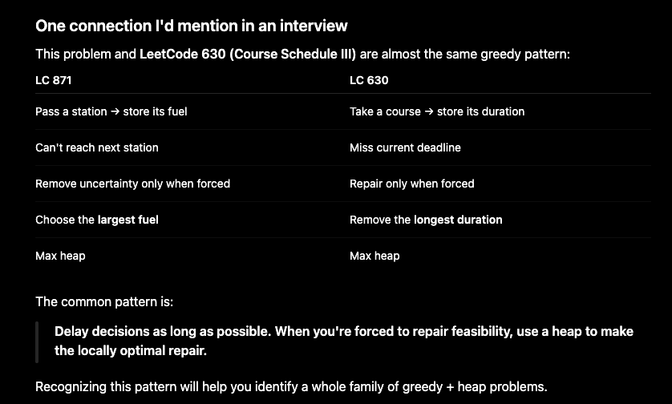

# Greedy (贪心)

> Section: **Algorithm** — split from Dynamic Programming. Greedy problems make a locally-optimal choice at each step that proves to lead to the global optimum, without needing to memoize states.

## Basic idea

1. Greedily assuming we can choose every element, and then make decision later 
2. 

## Problems

### [55. 跳跃游戏](https://leetcode.cn/problems/jump-game/)

1. **贪心算法**

   1. ```c++
      class Solution {
      public:
          bool canJump(vector<int>& nums) {
              int k = 0;
              for(int i=0;i<nums.size();i++){
                  if(i>k){return false;}
                  k = max(k,i+nums[i]);
              }
              return true;
          }
      };
      ```

### [45. 跳跃游戏 II](https://leetcode.cn/problems/jump-game-ii/)

1. ```c++
   class Solution {
   public:
       int jump(vector<int>& nums) {
           int minstep = 0; //最少步数
           int futherest = 0; //在当前范围内能跳最远的地方，也就是下一步后的边界。
           int border = 0;//记录在当前位置最远能跳到哪（设为b），然后根据当前位置i和b的范围里，选择最远的那个，更新futherset.
           // 整体思路就是每一步都选择能跳最远的那一步，这样就是最少的。
           for(int i=0;i<nums.size()-1;i++){
               futherest = max(futherest, nums[i]+i);
               if(i==border){
                   border = futherest;
                   minstep++;
               }
           }
           return minstep;
   
       }
   };
   ```

### [134. 加油站](https://leetcode.cn/problems/gas-station/)

1. 总的想法是遍历每个点作为起点，看看是否能遍历

   1. 肯定超时了

   2. ```java
      class Solution {
          public int canCompleteCircuit(int[] gas, int[] cost) {
              int n = gas.length;
              int gas_total=0; int cost_total = 0;
              int ans = 0;
              int plus = 0;
              for(int i=0;i<n;i++){
                  gas_total += gas[i];
                  cost_total += cost[i];
              }
              if(gas_total<cost_total){
                  return -1;
              }
              for(int j=0;j<n;j++){
                  if(gas[j]<cost[j]){
                      continue;
                  }
                  ans = j;
                  int num = 0;
                  int flag = 0;
                  for(int i=0;i<n;i++){
                      num += gas[(j+i)%n] - cost[(j+i)%n];
                      if(num<0){
                          flag = 1;
                      }
                  }
                  if(flag == 0){
                      break;
                  }
              }
              return ans;
      
          }
      }
      ```

2. 有没有什么可以降低时间复杂度的？

   1. 一次遍历
      1. 设点x为起点，最远能到y，那么一定到不了y的下一个点
      2. 设x，y路上的一点z，那么以z为起点，一定到不了y的下一个点（很显然，若以x为起点，能到z，那么还是有油的，以z为起点，一开始是没有油的）
      3. 所以，若以x为起点，开始跑，设能跑到y（还没遍历一圈），那么xy上任何一点都到不了y的下一个点，更别提遍历一圈了，所以直接跳过xy上的所有加油站，从y的下一个点开始遍历

### 871. 

1. https://leetcode.com/problems/minimum-number-of-refueling-stops/

2. Your code is actually **very good**. It's clean, and the logic is correct. The main issue isn't the implementation—it's that the **reasoning behind the greedy choice** isn't organized. In an interview, the interviewer cares much more about *how you arrived at the algorithm* than whether you can write the code.

   Here's how I'd explain it.

   ------

   # Step 1. Start from the brute force

   > At every station, I have two choices:
   >
   > - Refuel here.
   > - Skip this station.
   >
   > Since every station gives two choices, the brute-force solution is exponential.

   Then say:

   > So I need to identify whether there's a greedy property.

   ------

   # Step 2. Observe when a decision is actually needed

   This is the key insight.

   > Notice that I don't actually need to decide whether to refuel when I arrive at a station.

   Suppose

   ```
   Fuel = 100
   
   Station A : +20
   Station B : +40
   Station C : +80
   ```

   Whether I "fill up" at A immediately or wait until later makes **no difference**, because fuel never expires and there is no tank capacity limit.

   Therefore,

   > **Whenever I pass a station, I can simply remember its fuel amount instead of deciding immediately.**

   This is the first greedy observation.

   ------

   # Step 3. When do I have to make a decision?

   Only when I cannot reach the next station.

   Suppose

   ```
   Current fuel = 150
   
   Next station = 180
   ```

   Now I must refuel from one (or more) of the stations I've already passed.

   So the problem becomes

   > Among all previous stations, which fuel should I take?

   ------

   # Step 4. Why choose the largest fuel?

   This is the greedy proof.

   Suppose I need one more stop.

   Previous fuels are

   ```
   20
   40
   80
   ```

   If I choose

   ```
   20
   ```

   I gain 20 miles.

   If I choose

   ```
   80
   ```

   I gain 80 miles.

   Both cost

   ```
   one stop
   ```

   Since every refuel counts equally (1 stop),

   the larger fuel is always better.

   An exchange argument makes this rigorous:

   > Suppose an optimal solution chooses 20 instead of 80.
   > Replacing the 20 with 80 never increases the number of stops and only lets us travel farther.
   > Therefore an optimal solution always exists that chooses the largest available fuel.

   That's why the heap stores **all passed stations**, and whenever we're forced to refuel, we always take the largest one.

   ------

   # Step 5. Data structure

   Now everything naturally follows.

   ```
   Pass a station
           ↓
   Store its fuel
           ↓
   Need fuel?
           ↓
   Take the largest previous fuel
   ```

   That is exactly a max heap.

   ------

   # Interview explanation (1 minute)

   > I first observed that making a refueling decision at each station leads to an exponential search because each station can either be used or skipped.
   >
   > Then I noticed that I never need to decide immediately whether to refuel. Since there is no tank capacity limit and fuel never expires, passing a station only means I gain the **option** to use its fuel later.
   >
   > Therefore, I store the fuel amounts of all stations I've passed in a max heap.
   >
   > I only make a decision when I cannot reach the next station. At that point, I must refuel from one of the previous stations. Since every refuel costs exactly one stop, the greedy choice is to take the station with the largest fuel amount. An exchange argument shows that replacing any smaller fuel with a larger one never increases the number of stops and can only help reach farther.
   >
   > Thus, each station is inserted into the heap once and removed at most once, giving **O(n log n)** time.

   This explanation tells the interviewer **where the greedy came from**, not just what it is.

   ------

   # Your code with comments

   ```java
   class Solution {
       public int minRefuelStops(int target, int startFuel, int[][] stations) {
   
           // Max heap:
           // Stores the fuel amounts of all stations we've already passed.
           // We don't decide whether to use them immediately.
           // We only decide when we're forced to refuel.
           PriorityQueue<Integer> pq =
                   new PriorityQueue<>(Collections.reverseOrder());
   
           int currentFuel = startFuel;
           int count = 0;
   
           for (int[] station : stations) {
   
               int position = station[0];
               int fuel = station[1];
   
               // Already able to reach the target.
               if (currentFuel >= target) {
                   return count;
               }
   
               if (currentFuel >= position) {
                   // We can reach this station.
                   // Instead of deciding to refuel now,
                   // simply remember this fuel as an option.
                   pq.offer(fuel);
               } else {
   
                   // Can't reach this station.
                   // We are forced to refuel from previously passed stations.
                   // Greedy:
                   // Always use the largest available fuel because every refuel
                   // costs one stop, so we want the maximum benefit per stop.
                   while (currentFuel < position && !pq.isEmpty()) {
                       currentFuel += pq.poll();
                       count++;
                   }
   
                   // Still can't reach this station.
                   if (currentFuel < position) {
                       return -1;
                   }
   
                   // We've reached this station.
                   // Store its fuel for possible future use.
                   pq.offer(fuel);
               }
           }
   
           // After all stations, we may still need fuel to reach the target.
           while (currentFuel < target && !pq.isEmpty()) {
               currentFuel += pq.poll();
               count++;
           }
   
           return currentFuel >= target ? count : -1;
       }
   }
   ```

   ------

   ## One connection I'd mention in an interview

   This problem and **LeetCode 630 (Course Schedule III)** are almost the same greedy pattern:

   | LC 871                              | LC 630                             |
   | ----------------------------------- | ---------------------------------- |
   | Pass a station → store its fuel     | Take a course → store its duration |
   | Can't reach next station            | Miss current deadline              |
   | Remove uncertainty only when forced | Repair only when forced            |
   | Choose the **largest fuel**         | Remove the **longest duration**    |
   | Max heap                            | Max heap                           |

   The common pattern is:

   > **Delay decisions as long as possible. When you're forced to repair feasibility, use a heap to make the locally optimal repair.**

   Recognizing this pattern will help you identify a whole family of greedy + heap problems.
