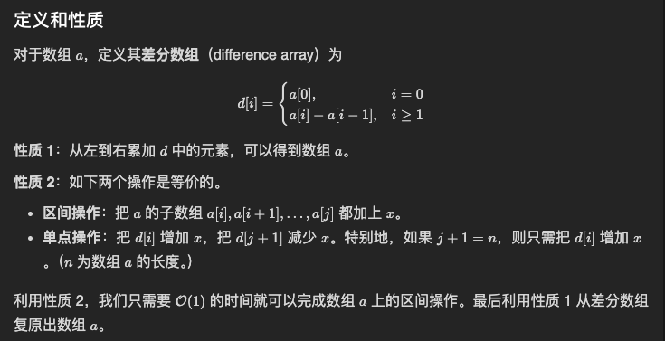

# Array (数组)

> Section: **Data Structure** — extracted from leetcode_solution.md (lines 5-37)

### 数组

1. `int ans[]; `java可以用这样的语句吗，先不定义数组的长度？
   1. 在Java中，可以声明一个数组而不指定其长度，但是在使用这个数组之前，需要为其分配内存空间并指定长度。因此，声明 `int ans[];` 是合法的语句，但在使用 `ans` 数组之前，应该通过 `ans = new int[length];` 来为其分配内存空间并指定长度。在这个语句之后，`ans` 数组才能被正常使用。

#### 双指针

1. 只要数组有序，就应该想到双指针技巧
2. 

#### 最长递增子序列

1. ```java
       public static int minModifications(int[] nums) {
           int n = nums.length;
           List<Integer> lis = new ArrayList<>();
   
           for (int num : nums) {
               int pos = Collections.binarySearch(lis, num);
               if (pos < 0) pos = -(pos + 1); //如果元素不存在，会返回插入位置（-index-1）
               if (pos == lis.size()) {
                   lis.add(num);
               } else {
                   lis.set(pos, num);
               }
           }
   
           return lis.size();
       }
   ```

---

## Appendix: Tips consolidated from `coding-tricks.md`

### Tip #0.2 — Java String manipulation

2. string
   1. how to tackle strings like path?
      1. ` /home/user/Documents/../Pictures` ?
      2. we use split() method to get the put the words apart
         1. ` String[] names = path.split("/");`

   2. multiple manipulation 

      1. ```java
         // The indexOf(char) method in Java returns the index (position) of the first occurrence of the specified character in a string. If the character is not found, it returns -1.       
         int star = p.indexOf('*');
         //index of a substring && substring from a to b(exclude)
         int i = s.indexOf(p.substring(0, star));
         //substring from x to end
         return i >= 0 && s.substring(i + star).contains(p.substring(star + 1));
         ```

   3. concatenate and decompose
      1. ` String sequence = list.get(i).web + " " + list.get(j).web + " " + list.get(k).web;`
      2. ` String[] r= res.split(" ");` (decomposition )
   4. Compare strings in a lexicographically smallest way
      1. ` if(str1.compareTo(str2)<0){// str1 is lexicographically smaller}`
   
   5. ` trim()`
   
      1. `String[] strArray = s.trim().split("\\s+");`
      2. Regular expression:` \\s+`, ` \\s`means any blankspace

### Tip #0.3 — Math helpers (mod, abs)

3. math
   1. mod
   2. Abs 
      1. ` Math.abs()`

### Tip #0.5 — Java array sort / lambda / toArray

5. array

   1. sort
      1. ` char[] s = str.toCharArray()`
      2. ` Arrays.sort(s)`;
      3. Sort by self-definition(lambda)
         1. ` Arrays.sort(intervals,(a,b)->a[0]-b[0]);`
            1. Intervals is a 2-dimensional array, we just compare each element by its first element 

      4. list to array
         1. `list.toArray(new int[ans.size()][])`;

### Tip #4 — Lambda comparator for List.sort

### 4. lambda expression in List

1. used to sort a list in a spectial way

   1. so the parameters in the lambda expression must be the element in list?

   2. Yes, in a lambda expression used with `list.sort()`, the parameters represent the elements being compared in the list. The lambda expression defines how two elements should be compared to determine their order.

      Here's a breakdown:

      1. **Parameters**: The two parameters (e.g., `s1` and `s2` in the string sorting example) represent two elements from the list. These are the elements you are comparing to decide their order.

      2. **Return Value**: The lambda expression should return an integer:
         - A negative integer if the first argument is less than the second (meaning the first should come before the second).
         - Zero if they are equal (no change in order).
         - A positive integer if the first argument is greater than the second (meaning the first should come after the second).

      ### Example Recap

      For example, consider this lambda expression used in sorting a list of integers:

      ```java
      numbers.sort((n1, n2) -> n2.compareTo(n1));
      ```

      Here:
      - `n1` and `n2` are parameters representing two integers from the list.
      - `n2.compareTo(n1)` is used to sort the numbers in descending order.

      ### Summary

      So, yes, the parameters in the lambda expression must correspond to the elements in the list being sorted. You can define how to compare these elements based on the desired sorting criteria.

   3. examples

      1. ```java
         import java.util.ArrayList;
         import java.util.List;
         
         class Person {
             String name;
             int age;
         
             Person(String name, int age) {
                 this.name = name;
                 this.age = age;
             }
         
             @Override
             public String toString() {
                 return name + " (" + age + ")";
             }
         }
         
         public class SortPersons {
             public static void main(String[] args) {
                 List<Person> people = new ArrayList<>();
                 people.add(new Person("John", 25));
                 people.add(new Person("Alice", 30));
                 people.add(new Person("Bob", 20));
         
                 // Sort by age using lambda expression
                 people.sort((p1, p2) -> Integer.compare(p1.age, p2.age));
         
                 System.out.println(people); // Output: [Bob (20), John (25), Alice (30)]
             }
         }
         
         ```

### Tip #11 — Sort char[] to canonicalize anagrams

### 11. String

1. since its a string, if we want to decide if two string has the same characters but different arrangements, instead of using hashmap to record, we can sort them first, and directly compare it using `HashMap<String, List<String>>`:

   1. ```java
                char[] arr=str.toCharArray();
                Arrays.sort(arr);
                String key=new String(arr);
      ```

### Tip #12 — Prefix sum (decide-then-add pattern)

### 12. Prefix sum

1. decide before add, 

   1. ```java
      
              for(int i=0;i<nums.length;i++){
                  sum += nums[i];
                  prefix[i] = sum;
                // decide first!!
                  if(map.containsKey(prefix[i]-k)){
                      ans+=map.get(prefix[i]-k).size();
                  }
                // add
                  if(map.containsKey(prefix[i])){
                     List<Integer> list = map.get(prefix[i]);
                     list.add(i);
                     map.put(prefix[i],list);
                  }else{
                      List<Integer> newList = new ArrayList<>();
                      newList.add(i);
                      map.put(prefix[i],newList);
                  }
               
              }
      ```

2. https://leetcode.cn/problems/maximum-subarray-sum-with-length-divisible-by-k/description/

   1. apart from dynamic programming, we can maintain a array that get the minimum value of the prefix at the index that modules k by i (i can be 0 to k-1)

### Tip #13 — Difference array

### 13. difference array

1. how it works?
   1. https://leetcode.cn/circle/discuss/FfMCgb/
   2. when to use?
      1. when counting frequency, but given an array of interval
         1. Normally we traverse the interval and add the frequency of the element in that interval with 1
         2. but we just add the first element, and subtract last element 
   3. main idea
      1. instead of updating a whole bunch of subarray, just update one value in difference array to make that happen
      2. since they are equivalent
      3. 
   4. For example, in
      1. https://leetcode.cn/problems/count-positions-on-street-with-required-brightness/
      2. instead of adding brightness to every position in the range of a light, in stead, just record what's added and what deleted between moving from  previous position to current position
      3. and add up all the  previous difference to get the current value (prefix sum)
      4. using this technique, we can shrink the complexity from O(N*M) to O(N+M)
   5. other problems
      1.

### Tip #22 — Math snippets (xor, random)

### 22. Math

#### 1. xor

1. property
   1. if a xor b = c, then b = c xor a

#### 2. random

1. in java:

---

## Problems consolidated from `miscellaneous-problems.md`

### [189. 轮转数组](https://leetcode.cn/problems/rotate-array/)

1. 我写的代码（有错误）

   1. ```c++
          void rotate(vector<int>& nums, int k) {
              int pos = 0;
              vector<int>* num_second  = new vector<int>();
              int total = nums.size();
              for(int j=0;j<total;j++){
                  pos = (j+k)%total;
                  num_second[pos] = nums[j];
              }
              nums = num_second;
              delete num_second;
              num_second = nullptr;
              return null;
          }
      ```

   2. 错误：

      1. 这段代码存在几个错误：

         1. `num_second` 是一个指向 `vector<int>` 的指针，但没有初始化为一个有效的对象。在使用指针之前，需要通过 `new` 运算符来分配内存并创建一个新的 `vector<int>` 对象。

         2. 在循环中，将 `nums[j]` 赋值给 `num_second[pos]`，但是 `num_second` 是一个指针，不能像数组那样直接通过索引进行赋值。应该使用 `push_back()` 函数将元素添加到 `num_second` 中。

         3. 在最后的返回语句中，使用了 `null`，但正确的写法应该是 `nullptr`。

         下面是修改后的代码示例：

         ```cpp
         int pos = 0;
         vector<int>* num_second = new vector<int>();  // 创建一个新的 vector<int> 对象
         
         int total = nums.size();
         for (int j = 0; j < total; j++) {
             pos = (j + k) % total;
             num_second->push_back(nums[j]);  // 将元素添加到 num_second 中
         }
         
         nums = *num_second;  // 将 num_second 的内容赋值给 nums
         
         delete num_second;
         num_second = nullptr;
         
         return nullptr;  // 使用 nullptr 表示空指针
         ```

         通过这些修改，代码中的错误得到了修正，并且可以正常运行。

   3. **这里的nums 是由**` vector<int>& nums`定义的**引用**，就是一个对象，可以直接拿来用。

      1. 所以` nums = *num_second;` 这里的赋值应该是` num_second`指向的对象。

2. 正确答案

   1. 这是需要额外分配空间的做法	

   2. ```c++
          void rotate(vector<int>& nums, int k) {
              int pos = 0;
              vector<int>* num_second  = new vector<int>(nums.size());
              int total = nums.size();
              for(int j=0;j<total;j++){
                  pos = (j+k)%total;
                  (*num_second)[pos] = nums[j];
              }
              nums = *num_second;
              delete num_second;
              num_second = nullptr;
      }
      ```

3. 解法二：环状替换 （不需要额外空间，仅需要一个变量用来保存要替换的值）

   1. ```c++
      	void rotate(vector<int>& nums, int k){
          int n = nums.size();
          k = k%n;
          int count = gcd(k,n);
          for(int start = 0; start<count;start++){
            int current = start;
            int prev = nums[start];
            do{
              int next = (start+k)%n;
              swap(nums[next],prev);
              current = next;
            }while(start != current);
          }
          
          
        }
      ```

      1. 核心想法是从1开始然后替换，比如说 ` 1,2,3,4,5,6,7`, k =2 , 那么仅需要一次就可以全部遍历完，顺序是` 1,3,5,7,2,4,6,1` 但是如果` 1,2,3,4,5,6,` 则需要两次遍历` 1,3,5,1` 和 ` 2,4,6,2`,
      2. 那么，如何确定遍历的次数？
         1. 已知 元素总数是n, 每跳一步是k，那么因为最后还是会回到最初的起点，所以是走过了整数数量的圈，不妨设遍历了a圈，然后这一圈遍历了b个元素，那么有 an = bk，又要a最小，所以 an就是n, k 的最小公倍数lcm。 又 所以 b = lcm/k， 遍历次数就是 n / （b） = lcm/k 就是n, k的最大公约数。
