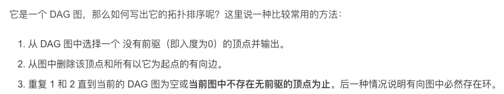

# Graph (图)

> Section: **Data Structure** — extracted from leetcode_solution.md (lines 1023-1311)

### 图

#### 图的遍历算法

1. 用队列实现BFS，用栈实现DFS，递归其实也是一种DFS

##### BFS(breath first search)

1. usually to solve shortest route question


##### dfs

1. 可以用栈实现，也可以用函数递归调用来实现

   1. 本质上，用栈实现是一个显示栈，而函数递归调用是一个隐式栈

2. 比较一下两者的优劣？

   1. 使用栈实现深度优先搜索（DFS）而非递归调用的好处主要取决于具体的应用场景和环境。在某些情况下，使用栈的方法可能会有性能上的优势，但这并不总是绝对的。下面是一些考虑因素：

      ### 1. 栈溢出的避免

      - **递归方法**：在深度很大的搜索树上使用递归可能会导致调用栈溢出，因为每一次函数调用都会消耗一定的栈空间，而系统为每个线程分配的栈空间是有限的。
      - **栈方法**：使用显式的栈来控制搜索过程可以帮助避免这个问题，因为它使用的是堆空间，而堆空间一般远大于栈空间。

      ### 2. 性能开销的比较

      - **递归方法**：递归调用本身有一定的开销，每次递归调用都会增加额外的调用栈帧，包括参数传递、局部变量存储等。
      - **栈方法**：使用显式栈虽然可以避免调用栈的消耗，但管理栈的操作（如入栈、出栈）也会引入开销，并且代码可能更加复杂，增加了维护的难度。

      ### 3. 可读性和易用性

      - **递归方法**：递归方法通常更容易理解和实现，特别是对于树或图的深度优先搜索，递归的代码往往更直观、更简洁。
      - **栈方法**：虽然使用栈可以提供更细粒度的控制，但代码通常会更复杂，逻辑不那么直观。

      ### 结论

      选择使用递归还是栈实现DFS，主要取决于具体问题的需求和环境限制。如果搜索树的深度非常大，且存在栈溢出的风险，那么使用栈可能是更好的选择。如果搜索树的深度适中，且代码的可读性和易用性更为重要，递归方法可能更优。

      在性能方面，是否有明显的优势并不总是一致的，需要根据具体情况分析。在某些情况下，递归的性能可能完全可以接受，而且由于其简洁性，更易于实现和维护。在其他情况下，显式栈的方法可能由于可以避免栈溢出而更受青睐，尤其是在深度搜索或资源受限的环境中。

   2. the relationship between dfs and recursion?

      1. 递归和深度优先搜索（DFS）有很强的联系，因为递归本质上是一种天然的深度优先搜索方式。以下是它们之间的联系和区别：

         ### 递归和DFS的联系

         1. **递归实现DFS**：
            - 递归是一种编程技术，允许函数调用自身。
            - DFS是一种遍历或搜索树或图的算法，优先深入到树或图的最深处。
            - 递归可以非常自然地实现DFS，因为每次递归调用都会深入到更深的层次，直到到达叶子节点或终止条件。
            - 在递归实现的DFS中，系统调用栈隐式地充当了栈数据结构，管理函数调用和返回。

         2. **递归的特性**：
            - 每次递归调用都会将当前状态（如当前节点、路径和等）压入系统调用栈中。
            - 当递归调用返回时，系统调用栈会弹出这些状态，回溯到上一个状态。
            - 这种“压栈”和“弹栈”的机制与DFS使用显式栈的机制相同。

         ### 递归实现DFS的示例

         以二叉树的遍历为例，以下是递归实现的DFS：

         ```java
         public class Solution {
             public int sumNumbers(TreeNode root) {
                 return dfs(root, 0);
             }
         
             private int dfs(TreeNode node, int currentSum) {
                 if (node == null) {
                     return 0;
                 }
                 currentSum = currentSum * 10 + node.val;
                 // 如果是叶子节点，返回当前路径的和
                 if (node.left == null && node.right == null) {
                     return currentSum;
                 }
                 // 递归计算左子树和右子树的路径和
                 int leftSum = dfs(node.left, currentSum);
                 int rightSum = dfs(node.right, currentSum);
                 return leftSum + rightSum;
             }
         
             public static class TreeNode {
                 int val;
                 TreeNode left;
                 TreeNode right;
                 TreeNode(int x) { val = x; }
             }
         
             public static void main(String[] args) {
                 TreeNode root = new TreeNode(1);
                 root.left = new TreeNode(2);
                 root.right = new TreeNode(3);
         
                 Solution solution = new Solution();
                 System.out.println(solution.sumNumbers(root));  // 输出 25
             }
         }
         ```

         ### 递归和显式栈实现DFS的区别

         虽然递归和显式栈都可以实现DFS，但它们在实现细节上有所不同：

         1. **递归实现**：
            - 使用系统调用栈来管理递归调用。
            - 代码简洁，易于理解和实现。
            - 受限于系统调用栈的深度限制，可能导致栈溢出（stack overflow）。

         2. **显式栈实现**：
            - 使用显式的栈数据结构来模拟递归调用。
            - 代码相对复杂，需要手动管理栈的压入和弹出。
            - 不受系统调用栈深度限制，更适合处理深度较大的树或图。

         ### 显式栈实现DFS的示例

         ```java
         import java.util.Stack;
         
         public class Solution {
             public int sumNumbers(TreeNode root) {
                 if (root == null) {
                     return 0;
                 }
         
                 int totalSum = 0;
                 Stack<Pair> stack = new Stack<>();
                 stack.push(new Pair(root, 0));
         
                 while (!stack.isEmpty()) {
                     Pair current = stack.pop();
                     TreeNode node = current.node;
                     int currentSum = current.currentSum * 10 + node.val;
         
                     // 如果是叶子节点，累加当前路径的和
                     if (node.left == null && node.right == null) {
                         totalSum += currentSum;
                     }
         
                     // 如果有右子节点，压入栈中
                     if (node.right != null) {
                         stack.push(new Pair(node.right, currentSum));
                     }
         
                     // 如果有左子节点，压入栈中
                     if (node.left != null) {
                         stack.push(new Pair(node.left, currentSum));
                     }
                 }
         
                 return totalSum;
             }
         
             private static class Pair {
                 TreeNode node;
                 int currentSum;
         
                 Pair(TreeNode node, int currentSum) {
                     this.node = node;
                     this.currentSum = currentSum;
                 }
             }
         
             public static class TreeNode {
                 int val;
                 TreeNode left;
                 TreeNode right;
                 TreeNode(int x) { val = x; }
             }
         
             public static void main(String[] args) {
                 TreeNode root = new TreeNode(1);
                 root.left = new TreeNode(2);
                 root.right = new TreeNode(3);
         
                 Solution solution = new Solution();
                 System.out.println(solution.sumNumbers(root));  // 输出 25
             }
         }
         ```

         ### 总结

         - **递归**：自然实现DFS，代码简洁，但受系统调用栈限制。
         - **显式栈**：手动管理栈，实现DFS，不受系统调用栈限制。

         希望这些解释能帮助你理解递归和DFS之间的联系。如果有其他问题，欢迎继续提问！

###### 岛屿问题

1. https://leetcode.cn/problems/number-of-islands/solutions/211211/dao-yu-lei-wen-ti-de-tong-yong-jie-fa-dfs-bian-li-
2. 主要思路就是dfs走一遍，base condition是当前的坐标不在图的范围内，或者当前的值为0
   1. 为了避免走重复的路，需要对走过的路进行标记，直接标记为2就行
   2. 

###### 例题

1. 有些题目需要求根节点到叶子结点的所有路径，因为要找到一个叶子结点才算结束一个查找，所以需要dfs来最先找到一个符合条件的项

   [129. Sum Root to Leaf Numbers](https://leetcode.cn/problems/sum-root-to-leaf-numbers/)

#### 图的克隆

1. 优先考虑用递归的方式做，用显示栈的话会显的很麻烦，从编码角度来讲。
   1. 需要用哈希表记录一下已访问过的节点

#### 有向图，加权边（权>=0），求距离最小： Dijkstra 算法

1. 核心： 其实就是遍历每条边，但是是根据与当前已经访问的图相连的权值最小的边开始，依次访问，并在访问途中更新最小值 --》那为什么不从权值最大的边开始？是否最终也能得到一样的结果？

2. 理解有误，其实是 每次pop出来一个点，就已经确定了src到该点的最小距离

   1. 如果有其他路径，比当前最小路径还小，那么那条路径上的点肯定在其他点之前就被入队处理了-->所以不可能漏下
   2. 状态从邻接接点开始传播

3. 把 Dijkstra 想成 **水波扩散** 🌊：

   - 水从源点出发
   - 以“单位时间 = 边权”向外扩散
   - **最先被水淹到的点，一定是最短路径到达的**
   - 所以，为了找到接下来被水淹到的那个点，一定要从当前已知距离最近的点开始（最小堆）

4. ```python
   import heapq
   
   def dijkstra(graph, start):
       dist = {node: float('inf') for node in graph}
       dist[start] = 0
       pq = [(0, start)]
   
       while pq:
           cur_dist, u = heapq.heappop(pq)
   
           # 关键：跳过过期状态
           if cur_dist > dist[u]:
               continue
   
           for v, w in graph[u]:
               if dist[v] > cur_dist + w:
                   dist[v] = cur_dist + w
                   heapq.heappush(pq, (dist[v], v))
   
       return dist
   ```

   

#### How to determine if a graph has a cycle?

##### Topological Sorting

1. how to get topological sorting?

   1. 

   2. STEPs

      1. Build the in-degree array: to determine if a vertex can be reached

      2. Initialize the queue: we shall be begin visiting the vertex with 0 in-degree. so we need 0-indegree queue

      3. Togological sorting process:

         1. ```java
            while (!queue.isEmpty()) {
                        int vertex = queue.poll();
                        visitedCount++;
                        
                        for (int j = 0; j < numVertices; j++) {
                            if (adjMatrix[vertex][j] == 1) {
                                inDegree[j]--;
                                if (inDegree[j] == 0) {
                                    queue.add(j);
                                }
                            }
                        }
                    }
            ```

##### Example Problem

1. [207. Course Schedule](https://leetcode.cn/problems/course-schedule/)
2.

---

## Appendix: Tips consolidated from `coding-tricks.md`

### Tip #19 — Kahn algorithm — cycle / topo order

### 19. graph

#### 1. decide whether there exists a circle in graph(khan algorithm)

1. bfs

   1. found all the vertices which have 0 indegree, visit them, delete them from graph
   2. Continue found 0-indegree vertice, visited them
   3. if all the vertices can be visited, then there's no circle in the graph

2. ```java
       int[] indegree = new int[numCourses];
       List<List<Integer>> adj = new ArrayList<>(numCourses);
       for(int i=0;i<numCourses;i++){
           adj.add(new ArrayList<>());
       }
        
       for(int[] prereq : prerequisites){
           adj.get(prereq[1]).add(prereq[0]);
           indegree[prereq[0]]++;
       }
       Queue<Integer> queue = new LinkedList<>();
       for(int j=0;j<numCourses;j++){
           if(indegree[j]==0){
               queue.offer(j);
           }
       }
       int visitedNum=0;
       while(!queue.isEmpty()){
           int curr = queue.poll();
           visitedNum++;
           List<Integer> neighbors = adj.get(curr);
           //delete
           for(int k=0;k<neighbors.size();k++){
               indegree[neighbors.get(k)]--;
               if(indegree[neighbors.get(k)]==0){
                   queue.offer(neighbors.get(k));
               }
           }
       }
       return visitedNum == numCourses;
   ```

3. leetcode 207(real problem)

